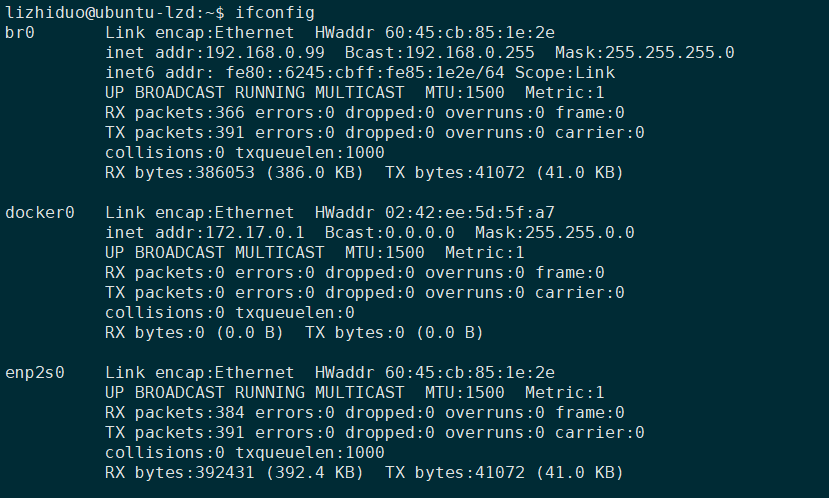

# qemu arm9
实验环境：ubuntu16.04
## qemu安装
>  安装qemu:`sudo apt-get install qemu`

## kernel
> 1. 下载 kernel(3.16) : `wget https://www.kernel.org/pub/linux/kernel/v3.x/linux-3.16.tar.xz`
> 2. 解压：`xz -d xx.tar.xz`;`tar xvf xx.tar`
> 3. 配置编译kernel:
>> * 安装交叉编译工具链：`sudo apt-get install gcc-4.7-arm-linux-gnueabi`,关于交叉编译器版本，最好使用4.7,其它版本可能会导致编译不过；建立软连接：`ln -s /usr/bin/arm-linux-gnueabi-gcc-4.7 /usr/bin/arm-linux-gnueabi-gcc`; 安装bc:`sudo apt-get install bc`
>> *  配置编译（CROSS_xx ARCH也可以通过export进行配置）：
```
>> make CROSS_COMPILE=arm-linux-gnueabi- ARCH=arm vexpress_defconfig
>> make CROSS_COMPILE=arm-linux-gnueabi- ARCH=arm menuconfig
>> make CROSS_COMPILE=arm-linux-gnueabi- ARCH=arm -j8
>> make CROSS_COMPILE=arm-linux-gnueabi- ARCH=arm dtbs
```
>4. 运行：
>
>```
>qemu-system-arm \
>	-M vexpress-a9 \
>	-m 512M \
>	-kernel linux-3.16/arch/arm/boot/zImage \
>	-dtb linux-3.16/arch/arm/boot/dts/vexpress-v2p-ca9.dtb \
>	-nographic \
>	-append "console=ttyAMA0"
>```
>


## 制作initrd

```
/*hello.c*/  
#include <stdio.h>  

void main()  
{  
    printf("Hello World\n");  
    printf("Hello World\n");  
    printf("Hello World\n");  
　　/*强制刷新输出，不然可能打印不出来*/  
    fflush(stdout);  
    while(1);  
}  
```
静态编译：
`arm-linux-gnueabi-gcc -static hello.c -o hello`
制作成cpio  
`echo helloworld | cpio -o --format=newc > rootfs.img（find . | cpio -o -Hnewc | gzip -9 > ../rootfs.img）`
运行：
`qemu-system-arm -M vexpress-a9 -m 512M -kernel linux-3.16/arch/arm/boot/zImage -dtb linux-3.16/arch/arm/boot/dts/vexpress-v2p-ca9.dtb -initrd rootfs.img  -nographic -append "console=ttyAMA0   rdinit=hello"`

## busybox编译
> 下载busybox：`wget http://www.busybox.net/downloads/busybox-1.26.0.tar.bz2`
> 解压：`tar xvjf busybox-1.26.0.tar.bz2`
> 配置：
>
> ```
> make defconfig
> make CROSS_COMPILE=arm-linux-gnueabi- menuconfig
> ```
>
> > * 需要选择 as a static binanry
> > * 交叉编译链、安装目录
>
> 编译安装：
>
> ```
> make CROSS_COMPILE=arm-linux-gnueabi-
> make CROSS_COMPILE=arm-linux-gnueabi- install
> ```
>
>
```
## 创建根文件系统镜像
> 创建根文件目录：
`mkdir  rootfs`
`mkdir bin dev etc lib proc sbin sys usr mnt tmp`
> 创建配置文件:
> ```
cd  etc(rootfs下的etc)
mkdir init.d
touch init.d/rcS fstab profile
```
>> rcS:
>> 修改文件权限：chmod +x rcS
>>
>> ```
>> #!/bin/sh
>> /bin/mount -a #挂载内核的各种文件系统 (fstab里面有指定)
>> /bin/mount -t tmpfs mdev /dev
>> mdev -s
>> ```
```
>> fstab:
>> ```
>> proc        /proc    proc    defaults    0    0
sysfs           /sys    sysfs   defaults    0   0
```
>> profile:
>> ```
>> #/etc/profile: system-wide .profile file for the Bourne shells
>> 
>> echo
>> echo -n "Processing /etc/profile... "
>> echo "Done"
>> echo
>> ```
```

> 创建设备文件:
> ```
cd rootfs
sudo mknod -m 666 dev/console c 5 1
sudo mknod -m 666 dev/null c 1 3
```
> 安装busybox:
> * 进入busybox根目录：`cd cd busybox-1.26.0`
> * 修改`.config`安装目录`CONFIG_PREFIX="../rootfs/"`
> * 执行`make CROSS_COMPILE=arm-linux-gnueabi- install`

> 制作cpio镜像：
> 执行如下命令：`cd rootfs && find . | cpio -o -Hnewc | gzip -9 > ../rootfs.img`

> 制作ext3格式镜像：
> 1. 生成32M大小的镜像
> `dd if=/dev/zero of=rootfs.ext3 bs=1M count=32`
> 2. 格式化成ext3文件系统
> `mkfs.ext3 rootfs.ext3`
> 3.  将文件拷贝到镜像中
> ```
> mkdir tmpfs
> sudo mount -t ext3 rootfs.ext3 tmpfs/ -o loop
> sudo cp -r rootfs/*  tmpfs/
> sudo umount tmpfs
> ```
启动流程：

linux内核启动，挂载根文件系统。然后启动init进程（bootargs中可以指定），init进程这里其实就是busybox会读取inittab，这里没有inittab，根据busybox源码parse_inittab（init/init.c）函数分析可知，会使用/etc/init.d/rcS这个脚本。在ash.c的ash_main函数中会判断isloginsh，若为真则会去读取/etc/profile这个全局的环境变量文件。busybox做根文件系统，比较重要的几个文件：inittab、rcS、fstab、profile,而且在busybox源码examples/bootfloppy目录下有相应的例子。

```

> 运行：
> * 运行cpio:
> `qemu-system-arm -M vexpress-a9 -m 512M -kernel linux-3.16/arch/arm/boot/zImage -dtb linux-3.16/arch/arm/boot/dts/vexpress-v2p-ca9.dtb -initrd rootfs.img  -nographic -append "console=ttyAMA0 rdinit=sbin/init"`
> * 运行ext3:
> `qemu-system-arm -M vexpress-a9 -m 512M -kernel linux-3.16/arch/arm/boot/zImage -dtb linux-3.16/arch/arm/boot/dts/vexpress-v2p-ca9.dtb -nographic -append "root=/dev/mmcblk0 console=ttyAMA0" -sd ./rootfs.ext3`

```

# uboot

下载：`wget http://www.busybox.net/downloads/busybox-1.26.0.tar.bz2`

配置编译：

```
make ARCH=arm CROSS_COMPILE=arm-linux-gnueabi-  vexpress_ca9x4_defconfig
make ARCH=arm CROSS_COMPILE=arm-linux-gnueabi- -j8
```

qemu运行uboot:

```
if true; then
qemu-system-arm -M vexpress-a9 \
    -kernel u-boot-2016.09/u-boot \
    -nographic \
    -m 512M
fi
```

修改uboot可以自动引导kernel:

```
bootargs&bootcommand修改（自动化引导）（include/configs/vexpress_common.h）：
/*
#define CONFIG_BOOTCOMMAND \
        "tftp 0x60003000 uImage; \
        setenv bootargs 'root=/dev/nfs rw \
 nfsroot=192.168.2.28:/home/lizd/work1/rootfs init=/linuxrc \
 ip=192.168.2.100 console=ttyAMA0'; \
        bootm 0x60003000;"
*/
#define CONFIG_BOOTCOMMAND \
        "tftp 0x60003000 uImage; tftp 0x60500000 vexpress-v2p-ca9.dtb; \
        setenv bootargs 'root=/dev/nfs rw \
 nfsroot=192.168.2.28:/home/lizd/work1/rootfs init=/linuxrc \
 ip=192.168.2.100 console=ttyAMA0'; \
        bootm 0x60003000 - 0x60500000;"
/*NET*/
#define CONFIG_IPADDR 192.168.2.100
#define CONFIG_NETMASK 255.255.255.0
#define CONFIG_SERVERIP 192.168.2.245
```

编译kernel(注意需要将uboot目录下的tool/mkimage拷到系统sbin目录下)：

`make CROSS_COMPILE=arm-linux-gnueabi- ARCH=arm  LOADADDR=0X60003000 uImage -j8`

启动脚本(此次需要关注一下qemu网络配置)：

```
qemu-system-arm -M vexpress-a9 \
    -kernel u-boot-2016.09/u-boot \
    -nographic \
    -net nic,vlan=0 -net tap,vlan=0,ifname=tap0 \
    -m 512M
```


# qemu网络配置

配置主机网络：

* 安装依赖：`sudo apt-get install  uml-utilities bridge-utils`

* 确认/dev/net/tun是否存在

* 修改/etc/network/interfaces文件（需要重启）

  ```
  auto enp0s2
  
  auto br0
  #iface br0 inet dhcp
  iface br0 inet static
  address 192.168.0.99
  netmask 255.255.255.0
  gateway 192.168.0.1
  dns-nameserver 192.168.1.1
  bridge_ports enp2s0
  ```

  重启后如下图所示：




